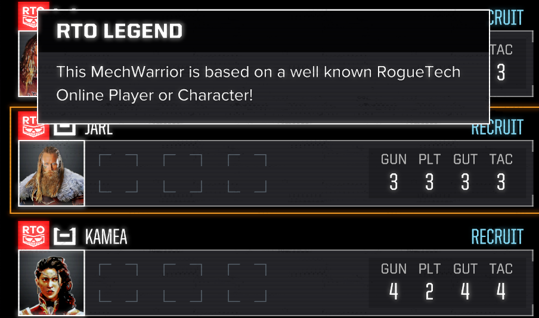

# MechAffinity

Mech Affinity is a feature rich framework-style mod that enables a number of new mechanics to HBS' 2018 BATTLETECH pc game.

High Level Feature Set (all can be enabled or disabled as needed):
- Pilots can gain experience with certain mechs the more they pilot them, resulting in various bonuses
- Pilots can have quirks, bonuses and/or malus' that results from their varied natured.
- Certain pilots can be made more distinguished from other pilots in the same manner that Ronin or KS Backers are
- Adjustments to Stability damage taken based on a pilot's piloting skill and quirks
- Reset Morale on a monthly basis
- Allow for new careers to pick guaranteed Ronin and/or random Ronin pilots
- New Combat Effects
- Have Requirements/Anti-Requirements for Ronin

As a framework-style mod, MechAffinity is highly configurable and is primarily designed to be integrated into modpacks like BattleTech Advanced 3062 (BTA), RogueTech (RT) or BattleTech Extended Commander's Edition (BEX/BEX:CE) and is a core piece of all of them.
This documentation is therefore aimed at modpack creator's who already have a decent understanding of various concepts like status effects, creating JSON files and tinkering with settings. However, MechAffinity is fully capable of being used stand-alone

### Available Editions

MechAffinity currently ships with 3 different versions of its DLL

#### Standard
This version of the DLL has no dependencies and can be used stand-alone. AssemblyVariant mode for Chassis/Tag affinities fallback to using the prefab mode. Vehicles cannot be given affinities

#### CustomSalvage/CustomComponents support

This version of the DLL requires the CustomSalvage & CustomComponents mods, but enables the AssemblyVariant mode for Chassis/Tag affinities

#### LewdableTanks support

This version the DLL requires the CustomSalvage, CustomComponents & LewdableTanks mods, but enables the AssemblyVariant mode for Chassis/Tag affinities and support for vehicles to be given affinities


## Settings Json

example:

```json
{
  "version": 2,
  "debug": false,
  "enablePilotAffinity": true,
  "enablePilotSelect": false,
  "enablePilotQuirks": false,
  "enableMonthlyMoraleReset": false,
  "enableStablePiloting": false,
  "enableMonthlyTechAdjustments": false,
  "enablePilotManagement": false,
  "affinitySettings": {},
  "quirkSettings": {},
  "stablePilotingSettings": {},
  "pilotUiSettings": {},
  "monthlyTechSettings": {},
  "pilotManagementSettings": {},
  "legacyData": {}
}
```
- `version`: used to determine if this settings file is compatible with the build, always set to `2`
- `debug` : when true enable debug logging
- `enablePilotAffinity` : When true, Pilots will build affinity with a mech each time they use that chassis,  with enough affinity they will get affinity Defs applied to earn bonuses on deployments
- `enablePilotQuirks` : when true, pilot quirk feaures will be enabled **Warning: This will conflict with Pilot Quirks mod**
- `enablePilotSelect` : when `true` allow set or random ronin to be part of the initial career start pilot roster. you must setup [Pilot Select Settings](#pilot-select-settings) in `pilotselectsettings.json` for this to work
- `enableMonthlyMoraleReset`: when `true` morale will be reset on the start of each month and then recalculated based on argo upgrades and pilot quirks
- `enableMonthlyTechAdjustments`: when `true` the argo funding levels will also incorporate mech/medtech buffs/maluses as part of their funding level features
- `enableStablePiloting`: when `true` enables 'Stable Piloting' features
- `enablePilotManagement`: when `true` enables pilot management features features
- `affinitySettings` : an [Affinity Settings](#affinity-settings) Object, this controls all settings for Affinity features
- `quirkSettings` : a [Pilot Quirk Settings](#pilot-quirk-settings) Object, this controls all settings for Pilot Quirks features
- `stablePilotingSettings` : a [Stable Piloting Settings](#stable-piloting-settings) object for controlling Stable Piloting features
- `pilotUiSettings`: a [Pilot UI Settings](#pilot-ui-settings) Object, this controls all settings and configuration for Pilot UI features
- `monthlyTechSettings`: a [Monthly Tech Adjust Settings](#monthly-tech-settings) Object, this controls all settings for the Monthly Tech Adjust features
- `pilotManagementSettings`: a [Pilot Management Settings](#pilot-management-settings) Object, this controls all settings for Pilot Management features
- `legacyData` : a `Legacy Data Settings` object, controls various options for outputting legacy versions of the settings file for compatibility with some third party tools

## Mech-Pilot Affinity

Affinity is a representation of a pilot's familiarity with a given mech chassis. As a pilot gets to know that mech better, they learn its quirks and how to squeeze some extra power out of it, however this experience may not translate to another
class of chassis, so for example a pilot who has spent years piloting a ShadowHawk, may fair poorly in a Vindicator.

Each deployment with a mech increases a pilot's affinity for that chassis by a single point, upon reaching enough deployments they will start to be granted 'affinities' until they have obtained all that can be obtained with that unit.
Affinities can come in the form of Buffs or Malus depending on the setup.

Depending on the setup of the below settings, affinities may decay over time as a way to represent a pilot losing familiarity with that unit until it reaches a defined minimum threshold or is forgotten entirely. These thresholds can be setup to always come from
the settings file or can be tracked by stats that in-game events or argo upgrades may modify as required.

**Note: Pilots will receive ALL affinities that they qualify for, not just the highest available to them**

### Affinity Settings

**These settings only apply when `enablePilotAffinity` is true**

```json
{
  "missionsBeforeDecay": -1,
  "lowestPossibleDecay": 0,
  "removeAffinityAfter": 100,
  "maxAffinityPoints": 1000,
  "decayByModulo": false,
  "debugForceTag": "",
  "defaultDaysBeforeSimDecay": -1,
  "showDescriptionsOnChassis": false,
  "trackSimDecayByStat": true,
  "trackLowestDecayByStat": false,
  "showAllPilotAffinities": true,
  "topAffinitiesInTooltipCount": 3,
  "showQuirks": false,
  "treatDefaultsAsFixed" : false,
  "affinityGroups": [],
  "prefabOverrides": []
}
```

- `missionsBeforeDecay` : the number of deployments a pilot can not use a chassis before their experience on that chassis begins to be lost, set to `-1` to disable
- `removeAffinityAfter` : the number of deployments a pilot can not use a chassis before all experience on that chassis is lost, this is used to clean up save data tracking, set to `-1` to disable
- `lowestPossibleDecay` : the lowest amount of a pilots experience with a chassis can decay to `removeAffinityAfter` overrides this value. this is counted in deployements when `trackLowestDecayByStat` is `false` the number in this settings will always be used. 
- if `trackLowestDecayByStat` is `true` this number becomes part of the save and cannot be changed from settings later. events or argo upgrades can
manipulate this value by changing the company stat `MaLowestDecay`
- `maxAffinityPoints` : the max amount of affinity that can be obtained for a unit once a pilot reaches this number with a chassis, further points will not be obtained
- `decayByModulo` : when set to true, decay is changed to 1 point for every `missionsBeforeDecay` instead of 1 point for every mission after `missionsBeforeDecay` missions
- `debugForceTag` : force affinity to process pilots as if they had this tag, for debugging use only
- `defaultDaysBeforeSimDecay` : the default number of days that can elapse before a pilot's affinities begin to decay. when `trackSimDecayByStat` is `true` this number becomes part of the save and cannot be changed from settings later. events or argo upgrades can
manipulate this value by changing the company stat `MaSimDaysDecayModulator`. setting this stat to -1 will stop decay from occuring when a day passes. deploying a pilot into a mission will reset that pilots counter. when `trackSimDecayByStat` is `false` this 
setting value will always be used
- `topAffinitiesInTooltipCount` : the number of mechs to show affinity about in the pilot tooltip, if the pilot has affinities with more mechs than this, mechs with the fewest affinities will be dropped from display
- `showQuirks` : when true, quirk affinities that are assiocated with a mech will be shown in the mechbay description of the mech in addition to any chassis specific affinities
- `showDescriptionsOnChassis` : when true, affinitys will be shown for chassis in the on hover chassis description in the mechbay storage screen
- `showAllPilotAffinities` : when true, the pilot dossier will show every affinity the pilot has with every chassis, when false only the highest level affininty will be show for a given chassis
- `affinityGroups` : a list of [AffinityGroup](#affinitygroup-objects) objects. These allow you to treat a group of prefabs/assembly IDs as a single ID
- `prefabOverrides`: a list of [PrefabOveride](#prefaboveride-objects) objects. These allow you to correct UI display issues caused by some of the game's "Dummy Units"
- `treatDefaultsAsFixed` : when true, mech defaults (like FCS, sensors, etc...) will be treated as fixed equipment for the purposes of quirk affinities. This setting can only be used with CustomComponents support enabled

#### AffinityGroup objects

affinity groups allow you to re-map prefab ids to be treated as one specific ID

```json
{
  "affinityId" : "",
  "assemblyGroup" : []
}
```

- `affinityId` : the ID you want the mentioned IDs to be mapped to. this is the ID you should use in affinities you want to assign
- `assemblyGroup` : the prefab/assemblyvariants you want to be remapped to the `affinityId`

#### PrefabOveride objects

Prefab overrides allow you to correct some UI display issues that may occur with affinities showing the wrong Mech name. the principle cause for this in vanilla is a few 'Dummy Mechs' within the game files used for the campaign tutorial

```json
{
  "prefabId" : "",
  "overrideName" : ""
}
```

- `prefabId` : the prefab ID that is causing an issue
- `overrideName` : the name to display in the UI instead of the auto-detected name

### AffinityDef Objects

Affinity Definitions (AffinityDefs) are JSON files loaded into the via ModTek's custom resource (Manifest entry of: `AffinityDef`)

these definitions are matched to the appropriate pilots on deployment of a mission.

```json
{
  "id": "",
  "affinityType": "Global",
  "affinityData": {}
}
```

- `id`: The affinity ID, this must be unique and must match the file name of the affinityDef (minus the .json file extension)
- `affinityType`: The type of affinity this definition is for. Valid values are:
  - `Global`: Affinities of this class are available on all chassis's (Note: experience on one chassis does not transfer to another)
  - `Chassis`: Affinities of this class are available only the chassis's named by the affinity 
  - `Tag`: Similar to Chassis affinities, but also requires the pilot to have a matching tag named by the affinity. This could be used to grant special affinities to pilots of a certain descent on chassis's of their homelands for example.
  - `Quirk`: Affinities of this class are available only to chassis that mount the equipment/weapon named in the affinity as fixed equipment (equipment that cannot be removed from that mech)
- `affinityData` A JSON object that represents the affinity, the exact schema of this will vary depending on the `affinityType`. see below for their definitions and schemas

#### GlobalAffinity objects

global Affinity Objects are simply [AffinityLevel](#affinitylevel-objects) objects, see their schema for how to layout a global affinity

#### Example Global Affinity AffinityDef
```json
{
  "id": "AffinityDef_global_Veteran",
  "affinityType": "Global",
  "affinityData": {
    "missionsRequired": 10,
    "levelName": "Veteran",
    "decription": "+1 Guts Boost",
    "affinities": [
      {
        "type": "Guts",
        "bonus": 1
      }
    ],
    "effectData": []
  }
}
```

#### ChassisAffinity objects

```json
{
  "chassisNames" : [],
  "affinityLevels" : [],
  "idType" : "AssemblyVariant",
  "altMaps": []
}
```

- `chassisNames` : a list of chassis this affinity is available to. 
- `affinityLevels` : a list of [affinityLevel](#affinitylevel-objects) objects to be considered for this affinity
- `idType` : This value defines how the values in `chassisNames` are interpreted Valid values:
  - `ChassisId`: The Chassis ID of the mech (from its chassisdef file).
  - `AssemblyVariant`: (the default), only useful when paired with the CustomSalvage mod. This uses CS's `AssemblyVarient` to pair mechs to this, if CS is not available, this falls back to the PrefabId method
  - `PrefabId`: the chassis name is the prefab name followed by a `-` and the tonnage of the mech. example chassis name for the assassin `chrPrfMech_assassinBase-001_40`
- `altMaps`: provides a way to map chassis to this affinity that use a different ID type. this is a list of [ChassisTypeMap](#chassistypemap-objects) objects

##### ChassisTypeMap Objects

```json
{
  "chassisIds": [],
  "idType": "AssemblyVariant"
}
```

- `chassisIds` : a list of chassis this affinity is available to.
- `idType` : This value defines how the values in `chassisIds` this is the same as [ChassisAffinity](#chassisaffinity-objects) 

#### Example Chassis Affinity AffinityDef
```json
{
  "id": "AffinityDef_chassis_Ambusher",
  "affinityType": "Chassis",
  "affinityData": {
    "chassisNames": [
      "TechieS",
      "TechieM",
      "TechieL",
      "phantasm_45",
      "wasp_20",
      "laohu_75",
      "Archangel_100",
      "Spector_35",
      "Chameleon_50",
      "Wight_35",
      "Stealth_45",
      "xenorauder_75",
      "xenoqueen_200",
      "Gestalt_45",
      "assassin_40",
      "exterminator_65",
      "RaptorIII_40",
      "RaptorII_40",
      "Imiut_45",
      "Aswang_40",
      "AssassinII_40",
      "Menshen_55",
      "Anubis_30",
      "cephalus_25",
      "shayu_40",
      "hermitcrab_25",
      "blueflame_45"
    ],
    "idType": "AssemblyVariant",
    "altMaps": [],
    "affinityLevels": [
      {
        "missionsRequired": 20,
        "levelName": "Ambusher",
        "decription": "-15% Signature and Visibility and +1 Local ECM",
        "affinities": [],
        "effectData": [
          {
            "Description": {
              "Details": "Pilot has Mastered the Chassis.",
              "Icon": "UixSvgIcon_specialEquip_System",
              "Id": "Affinity_Predator_Signature",
              "Name": "BattleMechAffinity"
            },
            "durationData": {
              "duration": -1,
              "stackLimit": -1
            },
            "effectType": "StatisticEffect",
            "nature": "Buff",
            "statisticData": {
              "statName": "SensorSignatureModifier",
              "operation": "Float_Multiply",
              "modValue": "0.85",
              "modType": "System.Single",
              "targetAmmoCategory": "NotSet",
              "targetCollection": "NotSet",
              "targetWeaponCategory": "NotSet",
              "targetWeaponSubType": "NotSet",
              "targetWeaponType": "NotSet"
            },
            "targetingData": {
              "effectTargetType": "Creator",
              "effectTriggerType": "Passive",
              "hideApplicationFloatie": true,
              "showInStatusPanel": false,
              "showInTargetPreview": false
            }
          },
          {
            "Description": {
              "Details": "Pilot has Mastered the Chassis.",
              "Icon": "UixSvgIcon_specialEquip_System",
              "Id": "Affinity_Predator_Visibility",
              "Name": "BattleMechAffinity"
            },
            "durationData": {
              "duration": -1,
              "stackLimit": -1
            },
            "effectType": "StatisticEffect",
            "nature": "Buff",
            "statisticData": {
              "statName": "SpottingVisibilityMultiplier",
              "operation": "Float_Multiply",
              "modValue": "0.85",
              "modType": "System.Single",
              "targetAmmoCategory": "NotSet",
              "targetCollection": "NotSet",
              "targetWeaponCategory": "NotSet",
              "targetWeaponSubType": "NotSet",
              "targetWeaponType": "NotSet"
            },
            "targetingData": {
              "effectTargetType": "Creator",
              "effectTriggerType": "Passive",
              "hideApplicationFloatie": true,
              "showInStatusPanel": false,
              "showInTargetPreview": false
            }
          },
          {
            "Description": {
              "Details": "Pilot has Mastered the Chassis.",
              "Icon": "UixSvgIcon_specialEquip_System",
              "Id": "Affinity_Predator_ECM",
              "Name": "BattleMechAffinity"
            },
            "durationData": {
              "duration": -1,
              "stackLimit": -1
            },
            "effectType": "StatisticEffect",
            "nature": "Buff",
            "statisticData": {
              "statName": "LV_ECM_SHIELD",
              "operation": "Int_Add",
              "modValue": "1",
              "modType": "System.Int32",
              "targetAmmoCategory": "NotSet",
              "targetCollection": "NotSet",
              "targetWeaponCategory": "NotSet",
              "targetWeaponSubType": "NotSet",
              "targetWeaponType": "NotSet"
            },
            "targetingData": {
              "effectTargetType": "Creator",
              "effectTriggerType": "Passive",
              "hideApplicationFloatie": true,
              "showInStatusPanel": false,
              "showInTargetPreview": false
            }
          }
        ]
      }
    ]
  }
}
```

#### QuirkAffinity objects

```json
{
  "quirkNames" : [],
  "affinityLevels" : []
}
```

- `quirkNames` : a list of fixed equipment on a chassis that this affinity should be applied to. use the items ComponentDefID for this field. a pilot can qualify for multiple quirk affinities, ideally this is used for mech quirks, but other fixed gear can also be used
- `affinityLevels` : a list of `affinityLevel` objects to be considered for this affinity

##### Example Quirk Affinity AffinityDef
```json
{
  "id": "AffinityDef_quirk_Afterburner",
  "affinityType": "Quirk",
  "affinityData": {
    "quirkNames": [
      "Gear_LegJet_Queen_Upper",
      "Gear_JumpJet_Extended_Superheavy",
      "Gear_JumpJet_Generic_Assault",
      "Gear_JumpJet_Generic_Heavy",
      "Gear_JumpJet_Generic_Standard",
      "Gear_JumpJet_Quad_FrontLeg_Assault",
      "Gear_JumpJet_Quad_FrontLeg_Heavy",
      "Gear_JumpJet_Quad_FrontLeg_Standard",
      "Gear_JumpJet_Prototype_Assault",
      "Gear_JumpJet_Prototype_Heavy",
      "Gear_JumpJet_Prototype_Standard",
      "Gear_JumpJet_Proto_Standard",
      "Gear_JumpJet_Proto_Superheavy",
      "Gear_JumpJet_SyberianHeavy",
      "Gear_LegJet_Assault_Upper",
      "Gear_JumpJet_Booster_clan",
      "Gear_JumpJet_Directional_MAD-DER",
      "Gear_JumpJet_Improved_Standard",
      "Gear_JumpJet_Improved_Heavy",
      "Gear_JumpJet_Improved_Assault",
      "Gear_JumpJet_Improved_Quad_FrontLeg_Standard",
      "Gear_JumpJet_Improved_Quad_FrontLeg_Heavy",
      "Gear_JumpJet_Improved_Quad_FrontLeg_Assault",
      "RedLabmorBoostpack",
      "Proto_JumpJetsHeavyCU3",
      "Proto_JumpJetsHeavyCU4",
      "Proto_JumpJetsHeavyCU5",
      "Proto_JumpJetsHeavyExtendedCU5",
      "Proto_JumpJetsHeavyExtendedCU6",
      "Proto_JumpJetsHeavyExtendedCU8",
      "Proto_JumpJetsLightCU3",
      "Proto_JumpJetsLightCU4",
      "Proto_JumpJetsLightCU5",
      "Proto_JumpJetsLightCU6",
      "Proto_JumpJetsLightCU7",
      "Proto_JumpJetsLightExtendedCU9",
      "Proto_JumpJetsUltraHeavyCU3",
      "Proto_JumpJetsUltraHeavyCU5",
      "Proto_JumpJetsUltraHeavyExtendedCU5",
      "Proto_JumpJetsUltraHeavyExtendedCU8"
    ],
    "affinityLevels": [
      {
        "missionsRequired": 150,
        "levelName": "Afterburner",
        "decription": "+5% Jump Distance",
        "affinities": [],
        "effectData": [
          {
            "durationData": {
              "duration": -1,
              "stackLimit": -1
            },
            "targetingData": {
              "effectTriggerType": "Passive",
              "specialRules": "NotSet",
              "effectTargetType": "Creator",
              "showInTargetPreview": false,
              "showInStatusPanel": false
            },
            "effectType": "StatisticEffect",
            "Description": {
              "Id": "AFTAHBURNAH",
              "Name": "CLAN TTS",
              "Details": "+2Acc, +50% Crit, +30% Range, -50%MinRange for ALL Weapons.",
              "Icon": "AdvancedTC"
            },
            "nature": "Buff",
            "statisticData": {
              "statName": "JumpDistanceMultiplier",
              "operation": "Float_Multiply",
              "modValue": "1.05",
              "modType": "System.Single"
            }
          }
        ]
      }
    ]
  }
}
```

#### TaggedAffinity objects

```json
{
  "tag" : "",
  "idType" : "AssemblyVariant",
  "chassisNames" : [],
  "affinityLevels" : []
}
```

`tag` : a tag that the pilot must have for this affinity to be considered
`chassisNames` : a list of chassis this affinity is available to.
`affinityLevels` : a list of `affinityLevel` objects to be considered for this affinity
`idType` : where the chassisNames are prefab ids or chassis IDs. same as [Chassis Affinities](#chassisaffinity-objects)

#### AffinityLevel objects

```json
{
  "missionsRequired" : 1,
  "levelName" : "Professional",
  "decription" : "Get A Major Gunnery Boost",
  "affinities" : [],
  "effectData" : []
}
```

- `missionsRequired` : the number of deployments required to receive this affinity
- `levelName` : the name of this affinity level
- `decription` : a description of this level *Note: Yes this is spelt wrong, but has been left as is for compatibility reasons*
- `affinities` : a list of [affinity](#affinity-objects) objects this level applies
- `effectData` : a list of status effects that this level applies

### affinity objects

Affinity objects provide a direct boost to a pilot's stats.

**Note: This provides a raw stat boost only, it does not confer additional abilities or traits that come with naturally leveling the pilot's skill up**

```json
{
  "type" : "Gunnery",
  "bonus" : 5
}
```

- `type` : the affinity type one of:
  - `Gunnery`
  - `Guts`
  - `Tactics`
  - `Piloting`
- `bonus` : the bonus to be applied to this skill

### Giving AI Pilots Affinities

non player pilots can also be setup to receive affinities. to do this add a pilot tag of `affinityLevel_X` where X is the number of deployments that should be granted to the pilot. pilots with this tag will be able to receive all affinities (Global, Chassis, Quirk & Tagged) that a player pilot of equal deployments is applicable for
you may also give affinities based on the weight class of a mech using `affinityLevelLight_X`, `affinityLevelMedium_X`, `affinityLevelHeavy_X`, `affinityLevelAssault_X` for the appropriate weight class

### Affinities By Tags

pilots may be granted experience towards affinities (of all types) by having special tags. there are 2 variants Permanent tags and Consumable tags. These tags can be part of a pilotdef when a pilot is generated
or added by events.

Permanent Tags: These tags provide the pilot with a permanent boost to their affinity count for a given chassis (unless they lose the tag).
permanent tags follow this scheme `MaPermAffinity_X=prefabId` where X is the number of deployments to be given, and prefabId is the chassis that this boost should be given to.

Example: Pilot Raza has been given the tag `MaPermAffinity_6=chrPrfMech_urbanmechBase-001_30` this means Raza has a permanent 6 points added when using the chassis `chrPrfMech_urbanmechBase-001_30` (the UrbanMech)

Consumable Tags: These tags provide the pilot with a boost to their affinity count for a given chassis. when a day passes this tag will be removed and the number of points will be added to the tracking stat.
these boosts are therefore subject to decay as normal affinity points are.
Consumable tags follow this scheme `MaConsumableAffinity_X=prefabId` where X is the number of deployments to be given, and prefabId is the chassis that this boost should be given to.

Example: Pilot Raza has been given the tag `MaConsumableAffinity_5=chrPrfMech_urbanmechBase-001_30` this means Raza has a 5 point boost added when using the chassis `chrPrfMech_urbanmechBase-001_30` (the UrbanMech),
overtime this may decay if Raza decides to pilot another mech.


## Pilot Quirks

Pilot quirks represent innate quirks of a pilot based on their physical, mental, socioeconomic backgrounds & behaviours. These quirks can manifest themselves in numerous active or passive ways.

Quirks may be used to grant buffs or malus's or both to a pilot. Quirks offer a wide range of options that can affect both sim-game and combat itself. In the event that the quirk's actual behaviour is provided
by another mod, making a QuirkDef may still be useful as a means to inform the user of that quirk, even if the actual implementation is elsewhere. For Example: Pilot Fiona's quirk grants her access to Airstrike abilities.
The actual implementation of this quirk is provided by a combination of mods and not MechAffinity itself, but the quirkDef is still created to display to the user and provide the extra monthly cost for employing such a powerful pilot.

Quirks may have their various features adjusted using the below settings.

### Pilot Quirk Settings

**These settings only apply when `enablePilotQuirks` is true**

```json
{
  "playerQuirkPools": false,
  "argoAdditive": true,
  "argoMultiAutoAdjust": true,
  "argoMin": 0.0,
  "quirkPools":[],
  "tooltipTags":[],
  "addTags":[],
  "tagUpdates": [],
  "restrictions": []
}
```

- `quirkPools` : a list of [QuirkPool](#quirkpool-objects) objects.
- `playerQuirkPools` : when `true` player pilots can also use quirk pools.
- `argoAdditive` : when `true` argo upgrade modifiers are processed using an additive model, when `false` a multiplicative model is used instead
- `argoMin` : the lowest possible argo upgrade modifier, defaults to 0.0
- `argoMultiAutoAdjust` : when `true` auto normalize modifiers for the multiplicative model (by adding 1.0 to the modifier before its factored in) instead of directly applying the modifier
- `tooltipTags` : a list of [PilotTooltipTag](#pilottooltiptag-objects) objects. These will be used for tooltips, this can be used for TBAS or for legacy functions of PilotQuirks for PilotFatigue support
- `addTags` : a list of pilot tags. When Quirks are enabled, these tags will be automatically added to any pilot in your roster
- `tagUpdates`: a list of [TagUpdate](#tageupdate-objects) objects. These can be used to roll out updates to existing pilots in the players roster without a save break.
- `restrictions`: a list of [QuirkRestriction](#quirkrestriction-objects) objects. These can be used to keep powerful quirks from being overused

#### QuirkPool objects

A quirk pool provides a way to randomly assign quirks to a pilot based on the presence of a tag. This is primarily useful for granting AI Pilots a random selection of quirks.

**Note: Pilots can qualify and use more than one quirk pool**

```json
{
  "tag" : "",
  "quirksToPick": 0,
  "quirksAvailable" : []
}
```
- `tag` : the tag that activates this quirk pool
- `quirksToPick` : the number of quirks to select from this pool
- `quirksAvailable` : a list of quirk tags this pool can select

#### PilotTooltipTag objects
```json
{
  "tag" : "",
  "tooltipText" : ""
}
```

- `tag` : the tag that activates this tooltip text
- `tooltipText` : the text for the tooltip, Note: a double new line will be automatically added to the end

#### TageUpdate objects
```json
{
  "selector": "",
  "addTags": [],
  "removeTags": []
}
```
TagUpdate objects allow you to selectively roll out updates to pilots during a routine update to your modpack. this can be used to add and/or remove tags from select pilots to correct bugs or add features to them.

- `selector`: the existing tag that signals this update should be run
- `addTags`: tags to be added to the pilots with the selector, if the tag already is on the pilot it will not be added a second time
- `removeTags`: tags to be removed from the pilots with the selector if the pilot has them.

#### QuirkRestriction objects
```json
{
  "restrictionCategory" : "",
  "deploymentCap": 0,
  "errorMsg": "",
  "errorTitle": ""
}
```
QuirkRestriction objects allow you to restrict powerful quirks from overuse by limiting the number of pilots with a particular quirk category

- `restrictionCategory`: the quirk category this restriction is placed on, any [QuirkDef](#quirkdef-objects) with a `restrictionCategory` that matches this will be subject to this restriction
- `deploymentCap`: the maximum number of quirks with this category that may be deployed in a single drop
- `errorMsg`: message text for the user when this restriction occurs
- `errorTitle`: title text for the user error message


### QuirkDef Objects

Quirk Definitions (QuirkDefs) are JSON files loaded into the via ModTek's custom resource (Manifest entry of: `QuirkDef`)

these definitions are matched to the appropriate pilots on deployment of a mission.

```json
{
    "id": "",
    "tag" : "",
    "quirkName" : "",
    "description" : "",
    "effectData" : [],
    "quirkEffects" : []
}
```
- `id`: The Quirk ID, this must be unique and must match the file name of the QuirkDef (minus the .json file extension)
- `tag` : a tag that the pilot must have for to be awarded this quirk
- `quirkName` : a human-readable name for this quirk, will be used in tooltips
- `description` : a description about what this quirk does
- `effectData` : a list of status effects that this quirk applies
- `quirkEffects` : a list of [QuirkEffect](#quirkeffect-objects) objects that will be applied to this quirk


### QuirkEffect Objects


```json
{
  "type" : "",
  "modifier" : 0,
  "secondaryModifier" : 0,
  "affectedIds" : []
}
```

QuirkEffect objects are for managing effects pilot quirks should apply that are sim game related
and cannot be done by status effects. not all effect types use all the fields available (unused fields for that effect are ignored)
pilots with multiple quirk effects of the same type are additive

available types:

- `MedTech`, `MechTech` and `Morale`
  These types are used to modify the companies MedTech or MechTech or Morale levels respectively by the amount specified by `modifier`. this can be an int or a float
  and can increment or decrement these levels for example one quirk could add `0.6` mechtech points while another could add `1.4` and a third could add `-0.1`
  this would net an overall boost of 1, with 0.9 leftover and stored for when the pilot roster changes


- `PilotCostFactor`
  This type modifies the amount it costs to hire and monthly pay of a pilot. this works as a multiplier to the standard costs of the pilot by the amount
  specified by `modifier` field. A modifier that is positive increases a pilots cost, while a negative decreases costs.
  `secondaryModifier` can be used to add or subtract a flat cost to the pilot's cost, this is applied before the `modifier` percentage costs are applied
  examples: a modifier of `0.3` with increase the cost of a pilot by 30%, while a value of `-0.25` will decrease the pilots cost by 25%


- `CriminalEffect` and `CriminalEffect2`
  This type introduces a pilot's ability to steal either for you or from you. When a day passes all pilots with this effect make a roll. on a successful
  roll they will steal a specified amount. the chance to steal is governed by `modifier` which specifies the percentage (as an int) to successfully roll
  a steal. `secondaryModifier` specifies the amount of cbills to steal when a successful roll is made, a positive amount steals from you, a negative amount
  steals from you. for example a modifier of `9` and a secondaryModifier with a value of 500 gives the pilot a 9% chance to steal 500 cbills from you
  when a day passes. `CriminalEffect2` is functionally identical, just used to make a second independent roll.


- `ArgoUpgradeFactor` and `ArgoUpkeepFactor`
  These types affect the pilots ability to reduce or increase the upfront cost or the monthly upkeep of an argo upgrade. the `modifier` field is a float that acts as a multiplier
  to the base/upkeep cost of the upgrade. `affectedIds` is a list of argo upgrade IDs that this quirk affects. to affect all upgrades a value of `PqAllArgoUpgrades` can be
  added to this list. example: `ArgoUpgradeFactor` with a modifier of `-0.3` and affectedIds list equal to `[PqAllArgoUpgrades]` will give a 30% cost reduction to
  the purchase cost of all upgrades. while a `ArgoUpkeepFactor` with a modifier of `0.15` will increase the monthly upkeep of all affected upgrades.


- `PilotHealth`
  This type is used to add or remove health from a pilot


- `Immortality`
  This type is used to grant a pilot the same plot-armour that your company-commander has been granted. Pilots granted immortality cannot be killed on the battlefield (although they may still be subject to death from events or from other mods)


- `AdditionalSalvage`
  This is used to grant additional salvage rights. `modifier` adds additional overall salvage allocation, while `secondaryModifier` adds to the number of priority picks you will receive. 
  *Note: pilots with this effect must be deployed to the battle for you to receive the benefits. You cannot increase the number of priority picks past 7 regardless of the value used, this is a game UI limitation*

- `AdditionalCbills`
  This is used to grant additional CBills on contracts deployments. `modifier` adds an additional flat payout, while `secondaryModifier` adds a percentage of the payout on top.
  *Note: pilots with this effect must be deployed to the battle for you to receive the benefits. Changes may not show on the results screen. Secondary modifier assumes a base value of 1.0, so to add a 5% pay bonus set this to 0.05, for a 5% decrease use -0.05*

#### Example QuirkDef:
```json
{
  "id": "pilotQuirkDef_pilot_blameMe",
  "tag": "pilot_blameMe",
  "quirkName": "Always Blamed",
  "description": "+2 Initiative. +1 Evasion Gained & Max. -1 Defense. +30% Upkeep",
  "effectData": [
    {
      "durationData": {
        "duration": -1,
        "stackLimit": -1
      },
      "targetingData": {
        "effectTriggerType": "Passive",
        "triggerLimit": 0,
        "extendDurationOnTrigger": 0,
        "specialRules": "NotSet",
        "effectTargetType": "Creator",
        "range": 0,
        "forcePathRebuild": false,
        "forceVisRebuild": false,
        "showInTargetPreview": false,
        "showInStatusPanel": false
      },
      "effectType": "StatisticEffect",
      "Description": {
        "Id": "MechwarriorQuirkInitiative",
        "Name": "Command Consoles",
        "Details": "Provides + 2 Initiative and several buffs.",
        "Icon": "uixSvgIcon_equipment_Cockpit"
      },
      "nature": "Buff",
      "statisticData": {
        "statName": "SBI_MOD_MISC",
        "operation": "Int_Add",
        "modValue": "2",
        "modType": "System.Int32"
      }
    },
    {
      "durationData": {
        "duration": -1,
        "stackLimit": -1
      },
      "targetingData": {
        "effectTriggerType": "Passive",
        "effectTargetType": "Creator"
      },
      "effectType": "StatisticEffect",
      "Description": {
        "Id": "MaxEvasion",
        "Name": "EVASIVE MOVE",
        "Details": "This unit generates an extra EVASIVE charge from movement actions (up to its maximum).",
        "Icon": "uixSvgIcon_action_evasivemove"
      },
      "statisticData": {
        "statName": "MaxEvasivePips",
        "operation": "Int_Add",
        "modValue": "1",
        "modType": "System.Int32"
      },
      "nature": "Buff"
    },
    {
      "durationData": {
        "duration": -1,
        "stackLimit": -1
      },
      "targetingData": {
        "effectTriggerType": "Passive",
        "effectTargetType": "Creator",
        "showInStatusPanel": false
      },
      "effectType": "StatisticEffect",
      "Description": {
        "Id": "GainEvasion",
        "Name": "EVASIVE MOVE",
        "Details": "This unit generates an extra EVASIVE charge from movement actions (up to its maximum).",
        "Icon": "uixSvgIcon_action_evasivemove"
      },
      "statisticData": {
        "statName": "EvasivePipsGainedAdditional",
        "operation": "Int_Add",
        "modValue": "1",
        "modType": "System.Int32"
      },
      "nature": "Buff"
    },
    {
      "durationData": {
        "duration": -1,
        "stackLimit": -1
      },
      "targetingData": {
        "effectTriggerType": "Passive",
        "effectTargetType": "Creator",
        "showInTargetPreview": false,
        "showInStatusPanel": false
      },
      "effectType": "StatisticEffect",
      "Description": {
        "Id": "StatusEffect-Defense_ToHit-T3",
        "Name": "HARDER TO HIT",
        "Details": "Provides a penalty to all attacks against this unit.",
        "Icon": "uixSvgIcon_equipment_Gyro"
      },
      "nature": "Buff",
      "statisticData": {
        "statName": "ToHitThisActor",
        "operation": "Float_Add",
        "modValue": "-1.0",
        "modType": "System.Single"
      }
    }
  ],
  "quirkEffects": [
    {
      "type": "PilotCostFactor",
      "modifier": 0.3,
      "secondaryModifier": 0.0,
      "affectedIds": []
    }
  ]
}
```

### Giving AI Pilots Quirks

non player pilots can be setup to get randomized quirks. To do this add quirk pools and make sure all AI pilots that should get quirks have at least one of the tags used by a quirk pool.

### Getting Custom Quirks To Show

any non-vanilla tag will not show up on the pilot's dossier in game by default. to get a custom quirk to show up like the above `Always Blamed` quirk, you will need to add custom tags
via modtek. See ModTek's [Custom Tag](https://github.com/BattletechModders/ModTek/blob/master/doc/CUSTOM_TYPE_CUSTOMTAGS.md) documentation for details on how to load them

## Pilot Select

Pilot Select allows a user to change how pilots are selected for the initial pilot roster on a new career.

It enables you to select specific Ronin, a random selection of Ronin, a number of procedural pilots or a combination for your career.

**Note: This is a port of [Select Pilots](https://github.com/BattletechModders/SelectPilots) to fix a conflict between the two mods, as such they will conflict when this is enabled**

### Pilot Select Settings

**These settings only apply when `enablePilotSelect` is true**

These settings control how many of each type of pilot to include in the initial pilot roster for a career.

```json
{
  "PossibleStartingRonin": [],
  "RoninFromList": 0,
  "ProceduralPilots": 4,
  "RandomRonin": 4
}
```

- `PossibleStartingRonin` : a list of ronin pilot IDs that can be selected when drawing from the list

example list for vanilla pilots:
```json
[
  "pilot_sim_starter_medusa",
  "pilot_sim_starter_behemoth",
  "pilot_sim_starter_dekker",
  "pilot_sim_starter_glitch"
]
```

- `RoninFromList` : the number of ronin to randomly select from the list
- `RandomRonin` : the number of ronin to randomly select from the entire pool of ronin in the game
- `ProceduralPilots`: the number of procedural pilots to generate to fill out the rest of the roster

### Pilot Select Restriction
```json
{
  "tags" : [],
  "limit" : 0,
  "restrictionId" : ""
}
```

Some pilots may offer special abilities or be extremely powerful, in some cases you may wish to have a limit on how many of these pilots a player can roll during a career start. Pilot Select Restrictions allow you to restrict pilots
from random ronin selection by putting limits on the number of pilots that can roll with a group of tags

- `tags` : a list of the tags in this restriction group
- `limit`: the limit of the number pilots that may have any tags from this group. Note that all tags count against this limit.
- `restrictionId`: an ID for this restriction group, should be unique

## Stable Piloting

Stable Piloting allows you to modify the incoming stability damage to a mech and adjust it depending on a pilot's piloting skill.

It can further modify the stability damage based on the tags a pilot has.

**Note: This is a re-imagining and expansion of the [Stabile Piloting](https://github.com/donZappo/StabilePiloting) feature set along with a bug fixes that prevented the original from really working and will conflict with it when enabled**

### Stable Piloting Settings

**These settings only apply when `enableStablePiloting` is true**

These settings control the 'Stable Piloting' feature set.

Stable Piloting allows for various modifications to stability damage taken by pilots.

```json
{
  "reductionPerPiloting" : 0.02,
  "increasePerInjury" : 0.05,
  "InverseMax" : 20,
  "tagEffects" : []
}
```

- `reductionPerPiloting`: the reduction of stability damage taken, per point of Piloting of a pilot. default setting is 2% reduction per level.
- `increasePerInjury`: the increase of stability damage taken, per injury on a pilot.
- `InverseMax`: The maximum Piloting skill level to use for Inverse tag effects. default is 20
- `tagEffects`: a list of [PilotTagStabilityEffect](#pilottagstabilityeffect-objects) objects

#### PilotTagStabilityEffect Objects

These objects define stability reductions or penalties for pilots possessing matching tags. A pilot with multiple matching tags will receive the benefits (or penalties) for all applicable tags.


```json
{
  "tag" : "pilot_klutz",
  "effect": 0.01,
  "type" : "Piloting"
}
```

- `tag`: the pilot tag required to apply this effect
- `effect`: the magnitude for this effect. Note that exactly how this is applied is based on the type. a positive value is a penalty (increase in stability damage taken), a negative is a boost (reduction in stability damage taken)

- `type`: This determines how `effect` is applied. Valid values for this field are:
  - `Flat`: the default value, the magnitude of this effect is simply the value of `effect`
  - `Piloting` : the magnitude of this effect is the `effect` value multiplied by the Piloting skill of the pilot.
  - `PilotingInverse` : the magnitude of this effect is the `effect` value multiplied by the `InverseMax` minus the Piloting skill of the pilot. When piloting reaches the Inverse Max or greater, this effect will become 0. This mode is best used to reduce a penalty as Piloting Skill grows.

## Monthly Tech Adjustment

Monthly Tech Adjustment adds some additional meaning to the various monthly funding levels of the Argo by adding a boost/malus to the mech and med tech values in addition to the morale modifier

**Note: This is a re-imagining and expansion of the [Monthly Tech Adjustment](https://github.com/donZappo/MonthlyTechandMoraleAdjustment) feature set to resolve conflicts with this mod and will conflict with it when enabled**

### Monthly Tech Settings

**These settings only apply when `enableMonthlyTechAdjustments` is true**

These settings control the 'Monthly Tech Adjustment' feature set.


```json

{
  "SpartanMedModifier": -4,
  "RestrictedMedModifier": -2,
  "NormalMedModifier": 0,
  "GenerousMedModifier": 1,
  "ExtravagantMedModifier": 2,
  "SpartanMechModifier": -4,
  "RestrictedMechModifier": -2,
  "NormalMechModifier": 0,
  "GenerousMechModifier": 8,
  "ExtravagantMechModifier": 2,
  "UiFontSize": 28
}

```

- `xxxMedModifier`: the buff/malus to the MedTech at the corresponding funding level, positive is a buff, negative is a malus. Note that this an adjustment from the baseline value, not an stacking modifier. This means if Spartan provides a -4 malus, taking Spartan for 2 straight months will still only be a -4 penalty, like wise with buffs
- `xxxMedModifier`: the buff/malus to the MechTech at the corresponding funding level, positive is a buff, negative is a malus. Note that this an adjustment from the baseline value, not an stacking modifier. This means if Spartan provides a -4 malus, taking Spartan for 2 straight months will still only be a -4 penalty, like wise with buffs
- `UiFontSize`: the fontsize of various parts of the financial report will not scale with additional text being added to the fields, to fix this we can scale the fontsize down to allow it to fit better. the default of 28 seems pretty good but is adjustable if needed. Note: vanilla's default size for these fields is 30 for comparision.

## Pilot Management Features

Pilot management allows you to add some additional flavour to your ronin, such as adding requirements for pilots to be hireable. This includes things like only allowing them to show up on certain worlds or worlds owned by certain factions. It may require you to
have one or more friends of this pilot on your crew already or they may refuse to work with other pilots if you have them.

### Pilot Management Settings

**These settings only apply when `enablePilotManagement` is true**

These settings control the 'Pilot Management' feature set.

```json
{
   "roninBlacklistTag": "",
    "enablePilotGenTesting": false,
    "enableRoninBlacklisting": false,
    "forcedRoninSelectionIds": []
  }
```

- `enableRoninBlacklisting`: when set to `true` any pilot with the `roninBlacklistTag` will be prevented from entering the hiring halls
- `enablePilotGenTesting`: when `true` override the pilot generator to account for pilots in `forcedRoninSelectionIds`, this should only be enabled for testing
- `forcedRoninSelectionIds`: a list of pilot IDs that will be given preference when generating a ronin pilot for the hiring halls. This is very useful for testing, but should not be used when not testing

### PilotRequirementsDef Objects

These objects are used to create restrictions for pilots

```json
{
  "TagId": "",
  "HiringRequirements": [],
  "HiringVisibilityRequirements": [],
  "RequiredSystemCoreIds": [],
  "RequiredSystemOwner": [],
  "RequiredPilotIds": [],
  "ConflictingPilotIds": []
}
```

- `TagId`: a pilot tag ID, any pilot with this tag will be subject to these restrictions
- `HiringRequirements`: a list of `RequirementDefs` (see contract requirements lists for examples) that a pilot must meet to be hire-able. Pilots failing these requirements will be able to enter the hiring halls but will not be able to be hired.
- `HiringVisibilityRequirements`: a list of `RequirementDefs` that a pilot must meet to enter the hiring hall. Pilots failing these requirements, will not be eligible to be in the hiring hall at all.
- `RequiredSystemCoreIds`: a list of starsystemDef Core IDs, these are the only worlds a pilot may be found in the hiring halls of, if empty the pilot may be found on any world.
- `RequiredSystemOwner`: a list of faction Names, a pilot will only be eligible to appear in the hiring hall if the faction who controls this system is in this list, if empty all factions are allowed.
- `RequiredPilotIds`: a list of pilot IDs that you are required to have in your current pilot roster to hire this pilot. All pilots in this list must be owned.
- `ConflictingPilotIds`: a list of pilot IDs. If you have any of these pilots in your current roster, this pilot will not be hire-able

**Note: For RequirementDefs, only the Commander, Company & StarSystem scopes are implemented**

## Pilot UI Modifications

Mech Affinity allows you to differentiate various pilots by altering their pilot icons in a similar manner to how vanilla Ronin or Kickstarter back pilots are distinguished.

example:



### Pilot UI Settings

```json
{
  "enableAffinityColour": false,
  "orderByAffinity": false,
  "pilotIcons" : [],
  "pilotAffinityColours" : []
}
```

- `iconColours`: a list of `PilotIcon` objects
- `pilotAffinityColours`: a list of `PilotAffinityColours` objects
- `enableAffinityColour`: when true the pilot expertise text (the text that says Recruit, Vanguard, etc) on a pilot roster slot will be colourized to show the approximate affinity level with the currently selected unit in the lance configuration screen
- `orderByAffinity`: when true unselected pilots in the lance configuration screen will be sorted based on their affinity level with the currently selected unit 

#### Pilot Icon Objects

```json
{
  "colour" : "#f21c1c",
  "tag" : "pilot_rtolegend",
  "descriptionDefId": "",
  "svgAssetId": "",
  "priority": 1
}
```

PilotIconColour objects allow you to change the pilot type's background colour to the specified colour, based on tags the pilot has.

*Note: if a pilot qualifies for multiple icons, the one with the lowest priority value will be used*

- `colour`: when not blank, pilots with the matching tag will have their pilot type icon background set to this colour, use HTML RGB Colour encoding
- `tag`: the tag the pilot must have for this icon updates to be applied
- `descriptionDefId`: when not blank, the pilot type tool tip text will be updated to use the `BaseDescriptionDef` with the matching ID, Mech Affinity or another mod must load this description via the mod.json manifest
- `svgAssetId`: when not blank, the pilot type icon will have the foreground icon replaced by the SVG Asset matching this ID, Mech Affinity or another mod must load this `SVGAsset` via the mod.json manifest
- `priority`: the priority for this icon data, the lower the number the higher the priority (ie. if a pilot matches 2 sets of icon data, then the one with the lowest value for priority will be used)

#### Pilot Affinity Colours Objects

```json
{
  "colour": "#f21c1c",
  "deploysRequired": 1
}
```

PilotAffinityColours objects allow you to change the pilot's expertise text colour in the lance configuration screen depending on the level of affinity they have with the selected unit. This
allows the player to get a rough idea of the pilot's affinity at a glance.

*Note: if a pilot qualifies for multiple colours, the one with the highest deployment requirement value will be used*

- `colour`: the text colour, use HTML RGB Colour encoding
- `deploysRequired`: the deployments required to earn this colour


## New Combat Effects

Mech Affinity enables the following new combat effects


### Super-Breaching Shot

Super-Breaching Shot is an enhanced version of the vanilla breaching shot ability. It differs from the standard breaching shot in the following ways:
- may be granted via gear, affinity or pilot quirk
- all non-melee weapons always use breaching shot, even with multiple weapons being fired

Given the power of this effect, it is recommended to keep access to it quite limited.

#### How to enable

Super-Breaching Shot is enabled via the `SuperPrecisionShot` status effect, allowing it to be granted by gear, affinities or pilot quirks.

example:
```json
{
  "durationData": {
    "duration": -1
  },
  "targetingData": {
    "effectTriggerType": "Passive",
    "effectTargetType": "Creator"
  },
  "effectType": "StatisticEffect",
  "Description": {
    "Id": "TC-Breaching",
    "Name": "BREACHING SHOT",
    "Details": "PASSIVE: Attacking with a single weapon ignores COVER and GUARDED on the target.",
    "Icon": "uixSvgIcon_ability_precisionstrike"
  },
  "statisticData": {
    "statName": "SuperPrecisionShot",
    "operation": "Set",
    "modValue": "true",
    "modType": "System.Boolean"
  },
  "nature": "Buff"
}
```

## Custom Resources

The following Custom Resource Types are used by this mod:

- AffinitiesDef
- QuirkDef
- LanceQuirkDef
- PilotRequirementsDef

## Upgrading from 1.3.0 or earlier

MechAffinity versions prior to 1.4.0 had a significantly different format that is no longer compatible with newer versions.

However, there is a relatively straightforward migration path:

1. Grab the latest MechAffinity build suitable for your environment
2. Drop the new DLL into your existing install
3. Start the game
4. ModTek will report that MechAffinity failed to load, *This is expected*
5. close the game and check your mechaffinity folder in mods, verify the following:
   1. settings.json is now significantly smaller and contains the new settings format
   2. settings.legacy.json has been created and contains your old settings
   3. A directory called `AffinityDefs` now exists and contains all your defined affinities as individual files
   4. A directory called `QuirkDefs` now exists and contains any pilot quirks you had defined as individual files
6. update your mod.json file to look something like this:

```json
{
	"Name": "MechAffinity",
	"Version": "1.4.0",
	"Enabled": true,
	"Hidden": false,
	"Author": "Jamie Wolf",
	"DLL": "MechAffinity.dll",
	"DLLEntryPoint": "MechAffinity.Main.Init",
	"CustomResourceTypes": ["AffinitiesDef", "QuirkDef"],
	"DependsOn": [
		"CustomComponents",
		"CustomSalvage"
	],
	"ConflictsWith": [],
	"Manifest": [
		{
			"Type": "AffinitiesDef",
			"Path": "AffinityDefs"
		},
		{
			"Type": "QuirkDef",
			"Path": "QuirkDefs"
		}
	]
}
```

*Note if you are using the version of MA that doesn't depend on custom components then the `DependsOn` entries should be omitted

